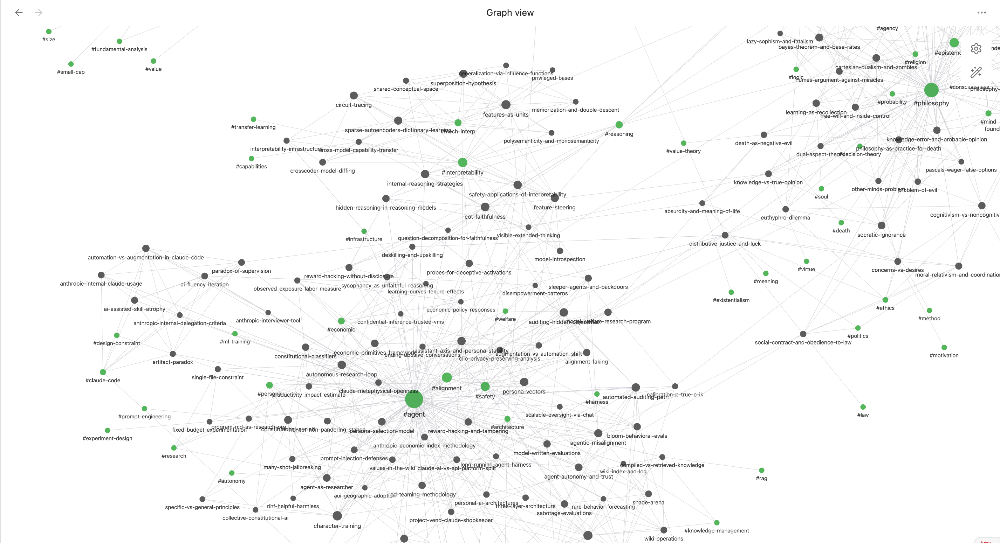

# Morning Brief

A personalized daily information system that scans sources you care
about, reads the ones worth reading, builds a wiki of structured
concepts from them, and writes you a morning brief explaining what's
new and why it matters. Runs unattended on a dedicated machine via
launchd and Claude Code.

## How it works

```
                ┌──────────┐    ┌──────────┐    ┌──────────┐
   sources ──→  │  radar   │ → │  ingest  │ → │  digest  │  → wiki/digests/
                └──────────┘    └──────────┘    └──────────┘
                  scan & drop    extract &       synthesize
                  to corpus      merge to wiki   daily brief
```

## What it looks like

**Knowledge graph growing from daily radar scans** — each node is a
concept page, edges are `[[wikilinks]]` between them.



**Daily digest in your voice** — radar articles and books synthesized
into a brief that explains why each concept matters to you personally.
([full example](docs/examples/daily-digest.md))

**Wiki pages with multi-source synthesis** — the same concept seen
through different authors, with tensions noted and a persona connection
tying it back to your work.
([full example](docs/examples/wiki-page.md))

## The chain

Three stages, one chain, one launchd job:

- **radar** wakes at 7am, scans the sources in `skills/radar/sources.yaml`,
  scores each candidate against `persona/character_sheet.md`, fetches the
  full content of anything that passes the relevance gate, and drops the
  markdown into `sources/corpus/reading/radar/{category}/`.
  Radar **does not summarize or read for content** — it's pure triage.
- **ingest** runs immediately after radar via `exec`. It hashes every file
  under `sources/corpus/reading/`, finds new and changed ones, parses them
  into structured concept extracts (`extracts/ingest/{slug}.yaml`), then
  merges those concepts into `wiki/topics/` pages. Existing pages get new
  perspectives appended; truly new concepts get their own page. Ingest
  doesn't care whether a file came from radar or from a manual Syncthing
  drop — same pipeline.
- **digest** runs immediately after ingest, also via `exec`. It reads
  ingest's `state.yaml`, finds books merged today, ranks the new concepts
  by `persona_relevance` and claim density, and writes a daily brief to
  `wiki/digests/YYYY-MM-DD.md`. The brief is the only narrative output —
  radar is silent, ingest is structural, digest is the surface you
  actually read in Obsidian each morning.

The whole chain is wired through a single shell script
(`run-module.sh`) that uses `exec` to hand the launchd-tracked PID
from one stage to the next, so failures short-circuit cleanly and
there's no nested process stack.

## Getting started

1. **Clone this repo** onto the machine that will run the system
2. **Fill in `persona/character_sheet.md`** — this is the relevance gate
   for radar and the voice model for digest. Without it, radar filters
   everything and digest sounds generic. You can build it interactively:
   ```bash
   cd ~/projects/morning-brief
   claude
   > Run the persona skill: read all files in sources/corpus/, extract
     behavioral signals, and populate persona/character_sheet.md.
   ```
3. **Edit `skills/radar/sources.yaml`** with the feeds and blogs you
   want radar to monitor
4. **Set up Syncthing** between your main machine and the twin (see
   [SETUP.md](SETUP.md) for details)
5. **Load the launchd plist** to schedule the daily chain (see
   [SETUP.md](SETUP.md) Phase 7)
6. **Test manually:** `./run-module.sh radar`

See [SETUP.md](SETUP.md) for the full walkthrough.

## Daily flow

**Morning, 7am:**
1. launchd fires `run-module.sh radar`
2. Radar scans → drops files into the corpus → autocommits its state to git
3. Chain → ingest reads the new corpus drops → updates the wiki
4. Chain → digest synthesizes today's wiki additions → writes the brief
5. Syncthing pushes the wiki (including the new digest) to your main machine
6. You open Obsidian on your main machine and read `wiki/digests/<today>.md`

**When you want to add a book manually:**
1. Drop the file into `sources/corpus/reading/{domain}/` on your main machine
2. Syncthing pushes it to the twin
3. Either wait for tomorrow's chain or run `./run-module.sh ingest` directly

## Project layout

```
morning-brief/
├── twin.yaml               module manifest (schedules, deps, sync config)
├── run-module.sh           launchd wrapper + chain orchestrator
├── CLAUDE.md               instructions Claude Code reads on every run
├── README.md               (this file)
├── SETUP.md                fresh-machine setup guide
│
├── skills/                 module skill definitions
│   ├── persona/            character sheet maintenance (manual)
│   ├── radar/              scan + triage + drop into corpus
│   ├── ingest/             read corpus → extract concepts → merge to wiki
│   ├── digest/             synthesize today's additions → daily brief
│   └── migrate/            one-shot health check after machine migration
│
├── persona/
│   └── character_sheet.md  the relevance gate and voice model
│
├── sources/                raw inputs (Syncthing-managed, mostly immutable)
│   ├── corpus/
│   │   └── reading/
│   │       ├── {domain}/   user-curated reading by topic
│   │       └── radar/      radar's drop zone (radar adds, never edits)
│   └── sync/               ad-hoc user → twin drop box
│
├── extracts/               derived intermediate state (twin-local)
│   ├── radar/
│   │   ├── state.yaml      URL de-dup (git-tracked)
│   │   └── YYYY-MM-DD.md   daily audit log
│   └── ingest/
│       ├── state.yaml      per-book hash + status manifest
│       └── {slug}.yaml     per-book structured concept extracts
│
├── wiki/                   the LLM-maintained knowledge base
│   ├── index.md            catalog of topics, books, entities
│   ├── log.md              cross-module activity log
│   ├── topics/             concept pages built by ingest
│   └── digests/            daily briefs written by digest
│
└── cron.log                run output from launchd
```

## Prerequisites

- macOS with Homebrew (designed for a dedicated Mac; adaptable to Linux)
- [Claude Code](https://docs.anthropic.com/en/docs/claude-code) (`npm install -g @anthropic-ai/claude-code`)
- An Anthropic API key
- [Syncthing](https://syncthing.net/) for file sync between machines
- [Obsidian](https://obsidian.md/) for reading the wiki (optional but recommended)

## Customization

The system is designed to be personalized:

- **`persona/character_sheet.md`** — your identity, expertise, values,
  and biases. This drives what radar considers relevant and how digest
  frames new concepts.
- **`skills/radar/sources.yaml`** — the feeds, blogs, and search queries
  radar monitors. Add sources that match your interests.
- **`skills/*/SKILL.md`** — the module definitions themselves. These are
  prompt-as-code: Claude Code reads them and executes the described
  behavior. You can tune scoring thresholds, output formats, or add
  new processing steps.

## Module reference

| Module                                 | Trigger                  | Reads                                          | Writes                                                       |
|----------------------------------------|--------------------------|------------------------------------------------|--------------------------------------------------------------|
| [persona](skills/persona/SKILL.md)     | manual                   | `sources/corpus/`                              | `persona/character_sheet.md`                                 |
| [radar](skills/radar/SKILL.md)         | launchd, daily 7am       | `sources.yaml`, `state.yaml`, persona          | `sources/corpus/reading/radar/`, `state.yaml`, audit log    |
| [ingest](skills/ingest/SKILL.md)       | chained after radar      | `sources/corpus/reading/`, persona             | `extracts/ingest/`, `wiki/topics/`, `wiki/index.md`         |
| [digest](skills/digest/SKILL.md)       | chained after ingest     | `extracts/ingest/`, persona, `wiki/topics/`    | `wiki/digests/YYYY-MM-DD.md`, `wiki/log.md`                 |
| [migrate](skills/migrate/SKILL.md)     | manual, after machine move | everything                                    | nothing (read-only health check)                             |

## Operating notes

**Single launchd job.** Only `radar` is scheduled. The chain (`exec`
into ingest, `exec` into digest) means launchd's tracked PID flows
through all three stages naturally.

**Failure semantics.** If any stage fails, `run-module.sh` exits
non-zero before the chain block, so downstream stages never run on
bad upstream output.

**State files:**
- `extracts/radar/state.yaml` — git-tracked, autocommitted by
  `run-module.sh` after each radar run.
- `extracts/ingest/state.yaml` and `extracts/ingest/*.yaml` — gitignored,
  regenerable from `sources/corpus/reading/`.
- `wiki/` — gitignored, Syncthing-managed, system → user.

**Where to look when something's wrong:**
1. `tail -50 cron.log` — chain markers and any stage-level errors
2. `extracts/radar/$(date +%Y-%m-%d).md` — what radar saw and why
   it accepted/rejected each item
3. `wiki/log.md` — cross-module activity log
4. `extracts/ingest/state.yaml` — per-book status
